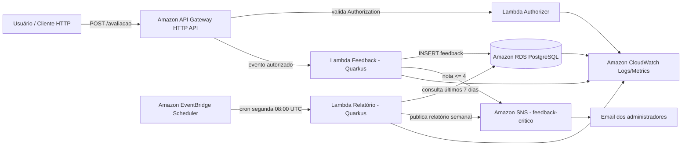

# Plataforma Serverless de Feedbacks

Este repositório contém uma plataforma serverless de feedbacks hospedada na AWS. A aplicação permite que usuários registrem avaliações, classifica automaticamente a urgência do feedback, notifica administradores quando houver itens críticos e gera um relatório semanal com indicadores de satisfação.

## Sumário

- [1. Visão geral do projeto](#1-visão-geral-do-projeto)
- [2. Requisitos atendidos](#2-requisitos-atendidos)
- [3. Arquitetura da solução](#3-arquitetura-da-solução)
- [4. Componentes do repositório](#4-componentes-do-repositório)
- [5. Modelo cloud escolhido](#5-modelo-cloud-escolhido)
- [6. Segurança e governança de acesso](#6-segurança-e-governança-de-acesso)
- [7. Fluxos da aplicação](#7-fluxos-da-aplicação)
- [8. API de entrada](#8-api-de-entrada)
- [9. Regras de negócio](#9-regras-de-negócio)
- [10. Banco de dados](#10-banco-de-dados)
- [11. Funções serverless criadas](#11-funções-serverless-criadas)
- [12. Monitoramento e observabilidade](#12-monitoramento-e-observabilidade)
- [13. Pré-requisitos para execução e deploy](#13-pré-requisitos-para-execução-e-deploy)
- [14. Configuração de variáveis de ambiente](#14-configuração-de-variáveis-de-ambiente)
- [15. Build local](#15-build-local)
- [16. Deploy em nuvem](#16-deploy-em-nuvem)
- [17. Testes manuais da API](#17-testes-manuais-da-api)
- [18. Operação do relatório semanal](#18-operação-do-relatório-semanal)
- [19. Troubleshooting](#19-troubleshooting)

## 1. Visão geral do projeto

A solução implementa uma **plataforma de feedbacks** hospedada na AWS com funções serverless. O endpoint principal recebe avaliações com `descricao` e `nota` de 0 a 10. A partir da nota, a aplicação classifica a urgência, persiste o feedback no PostgreSQL e envia notificação para administradores quando o feedback for crítico.

Além do recebimento em tempo real, uma função agendada executa semanalmente, consolida os feedbacks dos últimos 7 dias e publica um relatório com:

- média das avaliações;
- quantidade de avaliações por dia;
- quantidade de avaliações por urgência.

## 2. Requisitos atendidos

| Requisito do projeto | Implementação |
| --- | --- |
| Ambiente de nuvem configurado e funcionando | AWS com Lambda, API Gateway HTTP API, EventBridge Scheduler, SNS, RDS PostgreSQL, VPC, Subnets, Security Groups e VPC Endpoint para SNS. |
| Segurança dos dados e governança de acesso | Lambda Authorizer por API key, banco privado em VPC, RDS sem acesso público, Security Groups restritivos e permissões IAM por função. |
| Componentes de suporte | RDS PostgreSQL para persistência e SNS para notificações. |
| Deploy automatizado dos componentes atualizáveis | Serverless Framework para empacotar e publicar Lambdas e infraestrutura de suporte. |
| Aplicação monitorada | Logs e métricas nativas no Amazon CloudWatch para Lambda, API Gateway/EventBridge, SNS e RDS. |
| Notificações automáticas para problemas críticos | Feedbacks com nota menor ou igual a 4 são classificados como `CRITICO` e publicados no SNS. |
| Relatório semanal com média de avaliações | Lambda `lambda-relatorio` executada toda segunda-feira às 08:00 UTC por EventBridge. |
| Mínimo de duas funções serverless | Foram criadas três funções: feedback, relatório e authorizer. |
| Separação por responsabilidade única | Cada Lambda tem responsabilidade isolada: autenticação, recebimento/processamento de feedback e geração de relatório. |

## 3. Arquitetura da solução



### 3.1 Responsabilidades arquiteturais

- **API Gateway HTTP API**: expõe o endpoint `POST /avaliacao` e integra com o Lambda Authorizer.
- **Lambda Authorizer**: valida o header `Authorization` comparando com a chave definida em variável de ambiente.
- **Lambda Feedback**: valida payload, classifica urgência, salva o feedback e aciona notificação crítica quando necessário.
- **Amazon RDS PostgreSQL**: armazena feedbacks recebidos.
- **Amazon SNS**: distribui e-mails de alerta crítico e relatório semanal.
- **Lambda Relatório**: consulta dados agregados dos últimos 7 dias e publica o relatório semanal.
- **EventBridge Scheduler**: dispara a geração de relatório semanal.
- **CloudWatch**: centraliza logs, métricas e alarmes operacionais.
- **VPC, Subnets, Security Groups e VPC Endpoint**: mantêm o banco privado e permitem tráfego controlado entre Lambdas, RDS e SNS.

## 4. Componentes do repositório

```text
.
├── pom.xml                         # Projeto Maven pai com os módulos Quarkus
├── serverless-rds.yml              # Infraestrutura do RDS PostgreSQL
├── lambda-authorizer/              # Lambda de autorização por API key
├── lambda-feedback/                # Lambda HTTP para recebimento de feedbacks
└── lambda-relatorio/               # Lambda agendada para relatório semanal
```

### 4.1 Módulos Maven

- `lambda-feedback`: função Quarkus com endpoint REST/Lambda HTTP.
- `lambda-relatorio`: função Quarkus com handler AWS Lambda tradicional.
- `lambda-authorizer`: função Java usada como Lambda Authorizer no API Gateway.

## 5. Modelo cloud escolhido

O modelo escolhido foi **serverless na AWS**, utilizando serviços gerenciados para reduzir operação de infraestrutura, aumentar elasticidade e isolar responsabilidades por componente.

### 5.1 Justificativa

- **AWS Lambda**: executa código sob demanda, sem provisionamento de servidores e com cobrança por execução.
- **API Gateway HTTP API**: disponibiliza API pública com integração nativa com Lambda e authorizer.
- **EventBridge Scheduler**: agenda execução do relatório sem necessidade de cron em servidor.
- **SNS**: serviço gerenciado para fan-out e entrega de e-mails.
- **RDS PostgreSQL**: banco relacional gerenciado com backup, métricas e logs integrados ao CloudWatch.
- **VPC privada**: protege dados persistidos e evita exposição pública do banco.

## 6. Segurança e governança de acesso

### 6.1 Autenticação da API

O endpoint `POST /avaliacao` é protegido por um **Lambda Authorizer**. O cliente deve enviar o header:

```http
Authorization: <API_KEY>
```

A função authorizer compara o valor recebido com a variável `API_KEY` configurada no deploy.

Segredos e chaves de acesso são mantidos fora do código-fonte e fornecidos por variáveis protegidas do pipeline, AWS Secrets Manager ou SSM Parameter Store. Chaves expostas devem ser rotacionadas imediatamente.

### 6.2 Proteção do banco de dados

- RDS configurado como `PubliclyAccessible: false`.
- Acesso ao PostgreSQL limitado por Security Group.
- Porta `5432` liberada apenas para o Security Group da Lambda que grava feedbacks.
- RDS criado em DB Subnet Group com subnets da VPC.

### 6.3 Permissões IAM

Cada função declara apenas as permissões necessárias:

- `lambda-feedback`: `sns:Publish` no tópico de feedback crítico e permissão de invocação declarada para função alvo configurada.
- `lambda-relatorio`: `sns:Publish` no tópico de relatório/feedback.
- `lambda-authorizer`: sem permissões adicionais declaradas.

### 6.4 Comunicação privada com SNS

As Lambdas executam em subnets privadas. Por isso, os módulos `lambda-feedback` e `lambda-relatorio` criam **VPC Endpoint Interface para SNS**, permitindo publicar mensagens sem depender de acesso público direto à internet.

## 7. Fluxos da aplicação

### 7.1 Recebimento de feedback

1. Usuário envia `POST /avaliacao` com `descricao` e `nota`.
2. API Gateway chama o Lambda Authorizer.
3. Se autorizado, a requisição segue para `lambda-feedback`.
4. A Lambda valida obrigatoriedade e faixa da nota.
5. A nota é classificada como `CRITICO`, `MEDIO` ou `POSITIVO`.
6. O feedback é persistido no RDS PostgreSQL.
7. Caso seja `CRITICO`, a Lambda publica notificação no SNS.
8. Os administradores inscritos recebem e-mail com descrição, urgência e data de envio.

### 7.2 Geração de relatório semanal

1. EventBridge dispara `lambda-relatorio` toda segunda-feira às 08:00 UTC.
2. A Lambda consulta feedbacks com `data_envio >= hoje - 7 dias`.
3. São calculadas média, contagem por dia e contagem por urgência.
4. O relatório é publicado no SNS.
5. Administradores recebem o relatório por e-mail.

## 8. API de entrada

### 8.1 Endpoint

```http
POST /avaliacao
Content-Type: application/json
Authorization: <API_KEY>
```

### 8.2 Payload

```json
{
  "descricao": "Conteúdo da aula foi claro, mas o laboratório apresentou instabilidade.",
  "nota": 6
}
```

| Campo | Tipo | Obrigatório | Regra |
| --- | --- | --- | --- |
| `descricao` | string | Sim | Não pode ser nula ou vazia. |
| `nota` | integer | Sim | Deve estar entre 0 e 10. |

### 8.3 Respostas esperadas

#### Sucesso

```http
200 OK
```

```json
{
  "message": "Feedback recebido com sucesso"
}
```

#### Erro de validação

```http
400 Bad Request
```

```json
{
  "message": "A nota do feedback deve estar entre 0 e 10"
}
```

#### Erro interno

```http
500 Internal Server Error
```

```json
{
  "message": "Erro interno ao processar feedback"
}
```

## 9. Regras de negócio

### 9.1 Classificação da urgência

| Nota | Urgência | Ação |
| --- | --- | --- |
| 0 a 4 | `CRITICO` | Salva no banco e envia notificação imediata por SNS. |
| 5 a 7 | `MEDIO` | Salva no banco para análise posterior. |
| 8 a 10 | `POSITIVO` | Salva no banco para compor indicadores. |

### 9.2 Critério de ação imediata

Um feedback requer ação imediata quando a urgência calculada é `CRITICO`.

### 9.3 Dados do e-mail de urgência

A notificação crítica contém:

- descrição do feedback;
- urgência calculada;
- data de envio;
- assinatura do sistema de feedback.

### 9.4 Dados do relatório semanal

O relatório semanal contém:

- média das avaliações dos últimos 7 dias;
- quantidade de avaliações agrupadas por dia;
- quantidade de avaliações agrupadas por urgência.

## 10. Banco de dados

O projeto utiliza **PostgreSQL** em Amazon RDS. A aplicação espera a existência do banco `feedback` e de uma tabela chamada `feedback`.

### 10.1 DDL da tabela

Execute a criação da tabela no banco após provisionar o RDS:

```sql
CREATE TABLE IF NOT EXISTS feedback (
    id BIGSERIAL PRIMARY KEY,
    descricao TEXT NOT NULL,
    urgency VARCHAR(20) NOT NULL,
    nota INTEGER NOT NULL CHECK (nota BETWEEN 0 AND 10),
    data_envio TIMESTAMP NOT NULL DEFAULT CURRENT_TIMESTAMP
);

CREATE INDEX IF NOT EXISTS idx_feedback_data_envio ON feedback (data_envio);
CREATE INDEX IF NOT EXISTS idx_feedback_urgency ON feedback (urgency);
```

### 10.2 Campos utilizados pela aplicação

| Coluna | Uso |
| --- | --- |
| `descricao` | Texto do feedback recebido. |
| `urgency` | Classificação calculada pela Lambda. |
| `nota` | Avaliação numérica de 0 a 10. |
| `data_envio` | Data/hora usada nas notificações e agregações semanais. |

## 11. Funções serverless criadas

### 11.1 `lambda-authorizer`

| Item | Descrição |
| --- | --- |
| Responsabilidade | Autorizar chamadas ao endpoint de avaliação. |
| Handler | `org.acme.authorizer.AuthorizerHandler` |
| Entrada | Evento do API Gateway HTTP API com headers. |
| Saída | `{ "isAuthorized": true/false }`. |
| Variável necessária | `API_KEY`. |
| Logs principais | início da autorização, presença de headers/token e resultado da autorização. |

Funcionamento:

1. Lê o mapa `headers` do evento.
2. Obtém o header `authorization`.
3. Compara o valor com `API_KEY`.
4. Retorna `isAuthorized=true` somente em caso de correspondência exata.
5. Em erro ou ausência de header, nega a chamada.

### 11.2 `lambda-feedback`

| Item | Descrição |
| --- | --- |
| Responsabilidade | Receber, validar, classificar, persistir e notificar feedbacks críticos. |
| Endpoint | `POST /avaliacao`. |
| Handler Serverless | `io.quarkus.amazon.lambda.runtime.QuarkusStreamHandler::handleRequest`. |
| Handler HTTP interno | `FeedbackLambdaHandler.receber`. |
| Runtime | Java 25 com Quarkus. |
| Banco | PostgreSQL via datasource Quarkus/JDBC. |
| Notificação | SNS quando `nota <= 4`. |
| Variáveis necessárias | `DB_HOST`, `DB_MASTER_USERNAME`, `DB_MASTER_PASSWORD`, `SNS_TOPIC_ARN`. |

Principais classes:

- `FeedbackLambdaHandler`: adapter de entrada HTTP. Recebe o payload, chama o caso de uso e traduz erros em status HTTP.
- `ProcessFeedbackUseCase`: orquestra a criação do domínio, persistência e notificação crítica.
- `FeedbackFactory`: valida a requisição e classifica urgência com base na nota.
- `Feedback`: modelo de domínio com regra `requiresImmediateAction`.
- `LoggingFeedbackRepository`: adapter de saída para persistência no PostgreSQL.
- `LoggingCriticalFeedbackNotifier`: adapter de saída para publicação de alerta no SNS.

### 11.3 `lambda-relatorio`

| Item | Descrição |
| --- | --- |
| Responsabilidade | Gerar e enviar relatório semanal dos feedbacks. |
| Handler | `io.quarkus.amazon.lambda.runtime.QuarkusStreamHandler::handleRequest` com handler Quarkus `relatorio`. |
| Agendamento | `cron(0 8 ? * MON *)`, toda segunda-feira às 08:00 UTC. |
| Fonte de dados | Tabela `feedback` no PostgreSQL. |
| Saída | Publicação SNS com assunto `Relatório semanal de feedbacks`. |
| Variáveis necessárias | `DB_HOST`, `DB_MASTER_USERNAME`, `DB_MASTER_PASSWORD`, `SNS_TOPIC_ARN`. |

Consultas realizadas:

- média das notas dos últimos 7 dias;
- quantidade de feedbacks por data;
- quantidade de feedbacks por urgência.

## 12. Monitoramento e observabilidade

A aplicação utiliza recursos nativos da AWS para monitoramento.

### 12.1 Logs

Consultar logs no CloudWatch Logs:

```bash
aws logs tail /aws/lambda/lambda-feedback-dev-feedback --follow --region us-east-2
aws logs tail /aws/lambda/lambda-relatorio-dev-relatorio --follow --region us-east-2
aws logs tail /aws/lambda/lambda-authorizer --follow --region us-east-2
```

Eventos importantes registrados:

- autorização negada/autorizada no authorizer;
- feedback salvo com nota e urgência;
- publicação de notificação crítica no SNS;
- início, resumo e conclusão do relatório semanal;
- erros de conexão com banco, publicação SNS ou validação de payload.

### 12.2 Métricas monitoradas

Monitorar no CloudWatch:

| Serviço | Métricas |
| --- | --- |
| Lambda | `Invocations`, `Errors`, `Duration`, `Throttles`, `ConcurrentExecutions`. |
| API Gateway | contagem de requisições, latência, erros 4xx/5xx. |
| SNS | `NumberOfMessagesPublished`, falhas de entrega e confirmações de assinatura. |
| RDS | `CPUUtilization`, `DatabaseConnections`, `FreeStorageSpace`, `ReadLatency`, `WriteLatency`. |
| EventBridge | disparos do schedule e falhas de invocação. |

### 12.3 Alarmes operacionais

Criar alarmes para:

- qualquer erro em `lambda-feedback` em janela de 5 minutos;
- qualquer erro em `lambda-relatorio`;
- `Duration` da Lambda próxima ao timeout de 30 segundos;
- aumento de `5xx` no API Gateway;
- RDS com pouco espaço livre;
- falhas de entrega SNS.

Exemplo de criação de alarme para erros na Lambda de feedback:

```bash
aws cloudwatch put-metric-alarm \
  --alarm-name lambda-feedback-errors \
  --alarm-description "Erros na Lambda de recebimento de feedback" \
  --namespace AWS/Lambda \
  --metric-name Errors \
  --dimensions Name=FunctionName,Value=lambda-feedback-dev-feedback \
  --statistic Sum \
  --period 300 \
  --threshold 1 \
  --comparison-operator GreaterThanOrEqualToThreshold \
  --evaluation-periods 1 \
  --treat-missing-data notBreaching \
  --region us-east-2
```

### 12.4 Retenção de logs

Política de retenção:

- logs de aplicação: 14 dias;
- logs de auditoria e segurança: retenção definida pela política de compliance da organização.

Exemplo:

```bash
aws logs put-retention-policy \
  --log-group-name /aws/lambda/lambda-feedback-dev-feedback \
  --retention-in-days 14 \
  --region us-east-2
```

## 13. Pré-requisitos para execução e deploy

Instale/configure:

- Java 25 ou versão compatível com o runtime configurado nos `serverless.yml`;
- Maven ou Maven Wrapper dos módulos;
- Node.js e npm;
- Serverless Framework v3;
- AWS CLI configurada;
- credenciais AWS com permissão para Lambda, API Gateway, CloudFormation, IAM, SNS, RDS, EC2/VPC, EventBridge e CloudWatch;
- acesso às subnets/VPC informadas nos arquivos `serverless.yml`.

Instalação do Serverless Framework:

```bash
npm install -g serverless@3
```

Validação da conta/região:

```bash
aws sts get-caller-identity
aws configure get region
```

A região configurada no projeto é `us-east-2`.

## 14. Configuração de variáveis de ambiente

Antes do build/deploy, exporte as variáveis usadas pelos módulos:

```bash
export AWS_REGION=us-east-2
export DB_MASTER_USERNAME='postgres'
export DB_MASTER_PASSWORD='senha-forte-aqui'
export DB_HOST='jdbc:postgresql://<endpoint-rds>:5432/feedback'
export API_KEY='gere-uma-chave-segura'
```

Observações:

- `DB_HOST` deve estar no formato JDBC esperado pelo Quarkus: `jdbc:postgresql://host:5432/feedback`.
- O arquivo `serverless-rds.yml` cria o endpoint do RDS e exporta `FiapDatabaseEndpoint` no CloudFormation.
- Em um pipeline real, substitua exports locais por secrets do provedor de CI/CD, AWS SSM Parameter Store ou AWS Secrets Manager.

## 15. Build local

Na raiz do projeto:

```bash
./lambda-feedback/mvnw -f lambda-feedback/pom.xml clean package
./lambda-relatorio/mvnw -f lambda-relatorio/pom.xml clean package
./lambda-authorizer/mvnw -f lambda-authorizer/pom.xml clean package
```

Ou, usando Maven instalado:

```bash
mvn clean package
```

Os pacotes gerados produzem artefatos esperados pelos arquivos `serverless.yml`, como `target/function.zip` dentro de cada módulo.

## 16. Deploy em nuvem

> Os comandos abaixo assumem que as credenciais AWS, variáveis de ambiente, VPC e subnets já estão configuradas.

### 16.1 Ordem de deploy

1. **Authorizer**, para disponibilizar o ARN usado pela API.
2. **Lambda Feedback**, para criar Security Group exportado e tópico SNS.
3. **RDS**, que importa o Security Group da Lambda Feedback para liberar acesso privado.
4. **Lambda Relatório**, para criar função agendada e publicação do relatório.

### 16.2 Deploy do authorizer

```bash
cd lambda-authorizer
./mvnw clean package
serverless deploy --region us-east-2
cd ..
```

Após o deploy, confirme o ARN da função `lambda-authorizer` e atualize `lambda-feedback/serverless.yml` se a conta/região/função forem diferentes.

### 16.3 Deploy da Lambda de feedback

```bash
cd lambda-feedback
./mvnw clean package
serverless deploy --region us-east-2
cd ..
```

Ao final, o Serverless Framework exibirá a URL da HTTP API. Guarde essa URL para testes.

### 16.4 Deploy do RDS PostgreSQL

```bash
serverless deploy --config serverless-rds.yml --region us-east-2
```

Depois do deploy:

1. obtenha o endpoint exportado no CloudFormation;
2. configure `DB_HOST` com o endpoint JDBC;
3. crie a tabela `feedback` usando a DDL da seção [10.1](#101-ddl-da-tabela).

### 16.5 Deploy da Lambda de relatório

```bash
cd lambda-relatorio
./mvnw clean package
serverless deploy --region us-east-2
cd ..
```

### 16.6 Confirmação da inscrição de e-mail SNS

O SNS envia uma mensagem de confirmação para o e-mail configurado no tópico. O administrador deve clicar em **Confirm subscription** para receber notificações e relatórios.

## 17. Testes manuais da API

Substitua `<api-url>` pela URL exibida pelo Serverless após o deploy de `lambda-feedback` e `<API_KEY>` pela chave configurada.

### 17.1 Feedback positivo

```bash
curl -X POST '<api-url>/avaliacao' \
  -H 'Content-Type: application/json' \
  -H 'Authorization: <API_KEY>' \
  -d '{"descricao":"Aula muito clara e laboratório funcionando bem.","nota":9}'
```

Resultado esperado: feedback salvo no banco, sem alerta crítico.

### 17.2 Feedback crítico

```bash
curl -X POST '<api-url>/avaliacao' \
  -H 'Content-Type: application/json' \
  -H 'Authorization: <API_KEY>' \
  -d '{"descricao":"Não consegui acompanhar a aula e o ambiente ficou indisponível.","nota":2}'
```

Resultado esperado: feedback salvo no banco e e-mail de alerta crítico publicado via SNS.

### 17.3 Payload inválido

```bash
curl -X POST '<api-url>/avaliacao' \
  -H 'Content-Type: application/json' \
  -H 'Authorization: <API_KEY>' \
  -d '{"descricao":"Nota inválida","nota":11}'
```

Resultado esperado: HTTP 400 com mensagem de validação.

### 17.4 Chave inválida

```bash
curl -X POST '<api-url>/avaliacao' \
  -H 'Content-Type: application/json' \
  -H 'Authorization: chave-incorreta' \
  -d '{"descricao":"Teste sem autorização","nota":8}'
```

Resultado esperado: requisição negada pelo authorizer.

## 18. Operação do relatório semanal

A função `lambda-relatorio` é acionada automaticamente pelo EventBridge com a expressão:

```text
cron(0 8 ? * MON *)
```

Isso significa execução toda segunda-feira às 08:00 UTC.

Para execução manual pela AWS CLI:

```bash
aws lambda invoke \
  --function-name lambda-relatorio-dev-relatorio \
  --payload '{}' \
  --cli-binary-format raw-in-base64-out \
  --region us-east-2 \
  response.json
cat response.json
```

Valide no CloudWatch Logs se a mensagem `Relatório semanal processado com sucesso` foi registrada e confirme o recebimento do e-mail no endereço inscrito no SNS.

## 19. Troubleshooting

| Sintoma | Possível causa | Ação |
| --- | --- | --- |
| API retorna não autorizado | Header `Authorization` ausente ou diferente de `API_KEY`. | Conferir header enviado e variável configurada no authorizer. |
| API retorna 500 ao salvar feedback | `DB_HOST`, usuário, senha, tabela ou conectividade com RDS incorretos. | Verificar variáveis, Security Groups, tabela `feedback` e logs da Lambda. |
| Feedback crítico não envia e-mail | Assinatura SNS não confirmada ou `SNS_TOPIC_ARN` ausente. | Confirmar inscrição por e-mail e validar tópico/ARN no CloudFormation. |
| Timeout ao publicar SNS | Lambda em subnet privada sem rota/endpoints adequados. | Validar VPC Endpoint Interface para SNS e Security Groups. |
| Relatório sem dados | Não há feedbacks nos últimos 7 dias ou data do banco diferente. | Inserir avaliações de teste e conferir coluna `data_envio`. |
| Deploy falha por VPC/Subnet | IDs de VPC/subnet fixos não existem na conta usada. | Ajustar IDs nos arquivos `serverless.yml` para a conta AWS alvo. |

---

## Contexto do projeto

Plataforma serverless de feedbacks preparada para execução em ambiente cloud, com autenticação, persistência, notificações, relatório agendado, monitoramento e infraestrutura declarativa.
